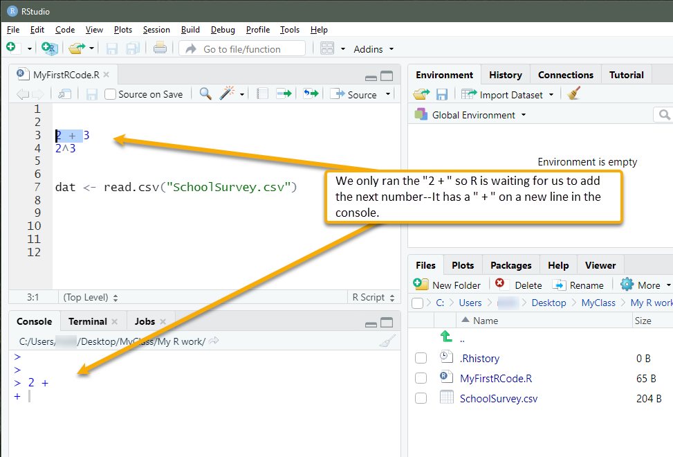
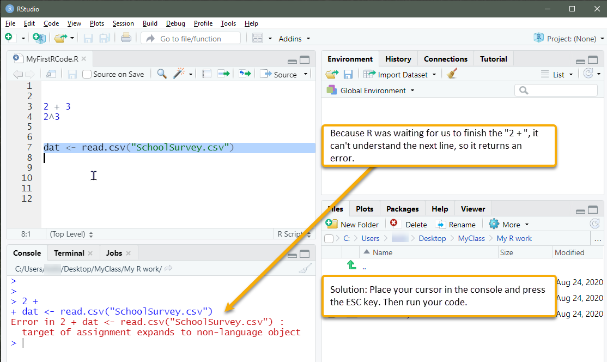
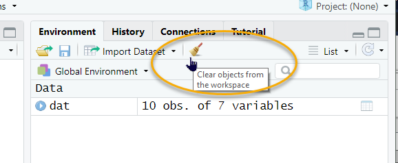

# Getting help and troubleshooting {#gettinghelp}

## R's help files

To find out more about a function, use the `help()` function. A shortcut for this is `?`. For instance,
```{r, eval=FALSE}
help("apply")
# Or, equivalently,
?apply
```

---- ---------------------------------------------------------
   \ <span style="color:gray"> The `#` sign is used to comment out code in R, so the line that says "`# Or, equivalently,`" is not evaluated.</span>

--------------------------------------------------------------

The help pane of RStudio should display information about the function we have placed in quotes or have placed after the question mark (if we've spelled it correctly). This is useful for seeing what arguments the function takes.^[However, a specific function for seeing what a function's arguments are is the `args` function, for example, `args(apply)`]. There is often a lot of useless technical information in R help files. However, if we scroll to the bottom of a help file, we can usually find examples.

If you want to see a list of the help files in a particular package, try `help(package = "package name")`. For example, if we wanted to see the help files for the `psych` package, we would run this code. Note that we would have to install the package and bring it into our library first (stuff for another tutorial).
```{r eval = FALSE}
help(package = "psych")
```

## Online help

Finally, there is a lot of information online. We can search for something like `How to use the apply function in R` in a search engine and find results.  If you conducted that search, you may have come across this site, which provides a nice visual of how the `apply()` function works when we use MARGIN = 2:
<https://www.datacamp.com/community/tutorials/r-tutorial-apply-family>

There's even a search engine specifically for R, RSeek at https://rseek.org/. Common sites that result from web searches are stackoverflow.com and stats.stackexchange.com. [RStudio provides a useful introduction page](https://support.rstudio.com/hc/en-us/articles/201141096-Getting-Started-with-R), too, among other resources on their site. 

## Why won't my code run?
One of the most frequent problems new users of R experience is when they have run only part of a section of code (such as only the `2 + ` in the example below) and the console is waiting for them to complete the code. R expects another number. But, when you run another line of code that you are so sure is correct, such as `dat<- read.csv("SchoolSurvey.csv")`, you keep getting errors. Annoying!



You can tell if this is the problem if the console has a `+` at the start of the line. It is expecting something to be added to complete the code. In the example here, R could not understand `2 + dat<- read.csv("SchoolSurvey.csv"`, so it returned an error.



The solution is to place your cursor in the console and then press `ESC` on your keyboard. Now try your code.

Another strategy is to clear your environment (as described in [Part 4](#saving)) and re-run your code. If we have objects in our R session that have mistakes, they will remain there until we replace them with the correct objects. Clearing the environment ensures they're gone. If you want even more peace of mind, clear your environment, save your R image, and reopen it to run your shiny new code. One troubleshooting strategy, after having cleared your environment, is to run portions of your code to isolate the error.
<br>



Finally, if we have error messages in our console, we can copy portions of that message and paste them within quotes into an online search, such as in https://rseek.org/. This sometimes reveals a solution to our specific problem.

## Have patience and keep learning

There will be times in our learning of R that we experience frustration. Because it is open source, it is a bit of a wild west environment. Package developers differ in their coding and what they expect us to know about their coding. So, what works with one function in one package might not work with another. We also might discover new workflows as we familiarize ourselves with R. The code in this tutorial is all from R's base R code. In other words, we did not rely on any packages. Another approach to coding in R is from the [Tidyverse](https://www.tidyverse.org/) collection of packages and developers, who strive to tidy up this wild west environment. Though Tidyverse is powerful, it still has limitations. It is wise to learn the basics of base R's language even if we wish to join the Tidyverse because many packages may be very useful yet not use Tidyverse conventions.

R is not only open source; it is very powerful. Although proprietary statistics programs are easier to use, we limit our capacity when we commit to their workflows. With R, collaboration does not require everyone pay for a license---there is no license. Published articles often include R code in their appendices for readers to use for their own work, which is powerful for continuing our data-analysis learning beyond our university education experience. Also, say you want to use what you learn in graduate school later on in your professional work. If your workplace does not pay for that proprietary license, you're at a loss. This is not a concern with R. Save your R files for adaptation for your future needs.

We can accomplish almost all of the same things in R as we can with proprietary programs. It also allows us to do things that otherwise would require multiple applications. We can manage all of our data and outputs from our analyses in a single project and save these in a reproducible format (i.e., our script). In contrast, with proprietary programs, we might have to juggle files between programs, which invites human error.^[For instance, we might manage data in one program, such as SPSS, save that data into a format for another program, such as MPlus, import that file into MPlus, then export those data back into another program, such as SPSS for prettier graphics. In R, all of our steps are pretty much in the same place.] Once we have a comfortable R workflow, we can continue learning new things in R and contribute our findings to the world.


