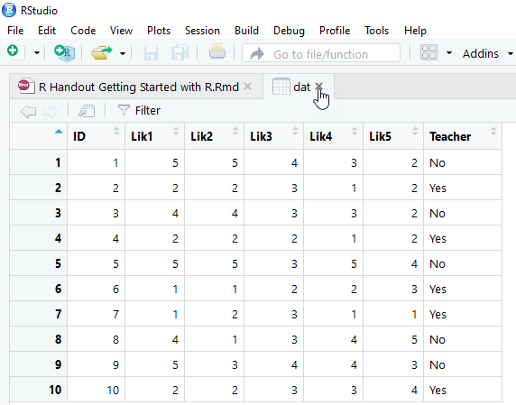
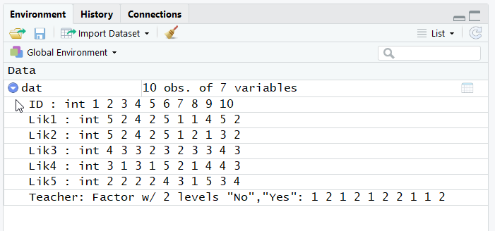

# Examining the data {#examining}
Let's make sure our data set was actually imported and that it was formatted in the way we expect. If we have a small data frame, as we do here, we can simply type a new line with our object, `dat`, select the object with our cursor, and run it to view the output in the console.^[When you run this code, you'll see the output in your console. In this handout (but not in your actual R session), it is displayed with double hash marks preceding each line.]
```{r, echo=FALSE}
dat <- read.csv("SchoolSurvey.csv")
```
```{r, eval=FALSE}
dat
```

---- ---------------------------------------------------------
   \ <span style="color:gray"> In R, a data set is called a ___data frame___. There are other types of objects in R; for example, a ___vector___ is a single column (or row) of data.</span>

--------------------------------------------------------------

If all went well, we should see this as our output:
```{r, echo=FALSE}
dat
```

## Making heads and tails of our data
Let's also look at the first six lines of data by performing the `head()` function on the data-frame object we just created. This is useful if we have a large data set and we simply want to see whether the variable names and first several observations look the way we expect them to.
```{r}
head(dat)
```
We can also examine the last six observations of our data frame using the `tail()` function.
```{r}
tail(dat)
```
## Point-and-click in RStudio
A point-and-click way we can examine our data frame, and any other objects in our current session, is through the environment pane in RStudio. <br>
<br>  
  

If we click on an object itself, such as on the `dat` here, RStudio will open a new tab in the script-editor pane and reveal the object.^[You can also use the `View()` function to open a data frame in a new tab and view it. Try the code `View(dat)`.] 

<br>
  <br>

With large data sets, this can take a while to load so this is not a typical part of the work flow, but for people who are used to SPSS, this brings some familiarity. Close that tab when you are done, or simply click back on the tab that contains the script you have written so far. 

## Viewing the structure of the data
If we click on the arrow icon in the environment pane, we can see the details.<br>
<br>

Alternatively, we can use the structure function, `str()`, to get the same information:
```{r}
str(dat)
```
Notice that our data comprise 10 observations of 7 variables. Also notice the list of variables. Next to each, after the colon, is a code that tells us what the variable's type is. Here, we have several variables listed as integers (`int`), which means they are numeric. We have one variable, Teacher, that is listed either as a character (`chr`) variable or a factor type of variable (`Factor w/ 2 levels "No","Yes"`), depending on which version of R you are running.^[The `read.csv()` function's defaults changed in one of the R versions so that character type of column data are read in as character instead of factors.] The character variable is a string. There can be many possible entries. A factor variable has levels, just like factors in ANOVA. Here, we would have two levels. Factor levels are coded under the hood with numbers, which by default match their alphabetical order, so here a "No" is coded as 1 and a "Yes" is coded as 2. The next set of columns are the first several observations of data (here, all 10), so the first person's PID was `1`, she or he selected `5` on the first two Likert-type questions, `4` on the third, and `3` and `2` on the next two questions. This person also selected `No`, coded as `1`, indicating that the individual is not a teacher. 

---- ---------------------------------------------------------
   \ <span style="color:gray"> Numeric variables are coded as `int` for integers (i.e., numbers without a decimal, such as whole numbers) or `num` for numeric (i.e., numbers that can have a decimal).
   \ <br>Factors are nominal variables with two or more levels. The factor level numbers merely indicate distinction among the levels rather than any ordered value. (However, later we will encounter ordered factors. An "ordered factor" is R terminology for a variable that is on an ordinal level scale of measurement.)</span>

--------------------------------------------------------------

## Extracting the names of the columns  
Sometimes, we need to know the names of the variables. For this, we can use the `names()` function.
```{r}
names(dat)
```
For extra fun, we can ask that the names of the output be in a format that is amenable to copying and pasting (we'll see the value of this in a minute). The `dput()` function does this.^[Notice that we can place functions inside of functions. The order of operations is the same as in mathematics, where the inside parentheses, `names(dat)`, are evaluated before the outside parentheses, `dput(...)`.] 
```{r}
dput(names(dat))
```
Notice that the output includes commas between the variables. This will be convenient in a minute.

## Subsetting data using `$` and indexing
Maybe we wish to examine a single variable in our data. Let's look at the first Likert-type item.

```{r}
dat$Lik1
```

---- ---------------------------------------------------------
   \ <span style="color:gray"> The dollar sign is used to select a particular column (i.e., variable) from the data. All rows of this column of data are included. Because we've selected a single column, the result is a ___vector___ of numbers.</span>

--------------------------------------------------------------

The dollar sign is one way to select a particular column in our data frame. Another way is to use indexing, with brackets. Within the brackets are two indices. The first is the row index and the second is the column index. If an index entry is blank, it instructs R to include all of the elements in that index. The following code is the same as `dat$Lik1` because it includes all the rows and the specified column, `Lik1`.
```{r}
dat[ ,"Lik1"]
```
---- ---------------------------------------------------------
   \ <span style="color:gray"> When we use indexing, we need to enclose the variable name in quotes. With data frames like this (in which we have multiple rows and columns), indexing is always in the order of row first and column second `[row,column]`.</span>

--------------------------------------------------------------

Indexing might seem redundant because we can use the dollar sign, but it is more powerful. For instance, we might want to only examine the first three persons. We can use numbers in indexing (instead of column or row names, if we want). Here are the responses from the first three people in our data set on this question:
```{r}
dat[1:3,"Lik1"]
```
The following code is equivalent to the one above, but now we're using numeric indexing for the column. Note that `Lik1` is actually the second column in our data set, so we use `2` in the column index.
```{r}
dat[1:3, 2]
```

## Creating objects with the combine function
The combine function, `c()`, is probably the most frequently used function in R. Here, we're combining several character strings and assigning them to an object, which we'll arbitrarily call `Likerts`.^[Just like SPSS, Excel, and other programs, R distinguishes character strings from numeric values.] Because these are character strings, each element is in quotes.^[This is where the `dput(names(`our data frame`))` function comes in handy---we can manually copy part of our output from that and paste it into our code here without having to type the quotes and commas.] We can view the result by retyping the object we just created (and running it).
```{r}
Likerts<- c("Lik1", "Lik2", "Lik3", "Lik4", "Lik5")
Likerts
```

---- ---------------------------------------------------------
   \ <span style="color:gray"> When we want to refer an object, we do *not* use quotes. Here, `Likerts` is an object. This is in contrast to our reference to the variable `Lik1` in the code above, `dat[ ,"Lik1"]`, which was enclosed in quotes because it was the name of that column.</span>

--------------------------------------------------------------

Notice that this object, `Likerts`, includes the names of five Likert-type variables in our data set. We can look at this subset of data using the following code:
```{r}
dat[ ,Likerts]
```
We can also use `c()` with indexing. Let's examine only the first Likert-type question and the Teacher variable:
```{r}
dat[ ,c("Lik1","Teacher") ]
```
It looks like all the teachers provided lower ratings on this question than their counterparts.

## Putting the functions together  
Here is some of the code we've addressed so far:
```{r, eval=FALSE}
dat<- read.csv("SchoolSurvey.csv")
dat
head(dat)
tail(dat)
str(dat)
names(dat)
dput(names(dat))
Likerts<- c("Lik1", "Lik2", "Lik3", "Lik4","Lik5")
Likerts
dat[ ,Likerts]
dat[ ,c("Lik1","Teacher") ]
```
Here is a typical set of functions for checking whether our data have been correctly imported:
```{r, eval=FALSE}
dat<- read.csv("SchoolSurvey.csv")
dat
head(dat)
tail(dat)
str(dat)
```
