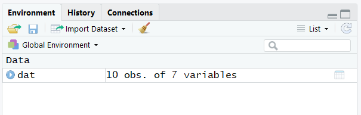

```{r setup, include=FALSE}
library(tufte)
# invalidate cache when the tufte version changes
knitr::opts_chunk$set(tidy = FALSE, cache.extra = packageVersion('tufte'))
options(htmltools.dir.version = FALSE)
```

# What is R
R [@R-base] is an open-source language and environment that is primarily used for conducting statistical analyses and managing data. 

RStudio [@RStudio] is an open-source graphical environment for running R, viewing output, and doing other things (like creating this document). We will use RStudio in our class.

The R community is huge and people develop R packages that we can download (through R) and use for specific types of analyses. For instance, in this course we will eventually use the survey package [@survey-package]. 

# Download R, then RStudio
You can view videos on how to download R and RStudio here:  <http://go.hawaii.edu/wKf> . On that web page, go to the Set Up panel on the left side of the web page to see the videos. The URLs that the video mentions are here: <https://cloud.r-project.org/> for downloading R and here, <https://www.rstudio.com/products/rstudio/download/> for downloading RStudio.

# Creating and re-opening an R script file
Create a new R script: Here are two ways to create a new R script file:

1. Open RStudio to get a blank source script page; then, save the file (using the `File` menu), giving it a name with the extension `.R` and selecting a directory on your  computer where you want it to be saved (such as a folder for this class). After doing this, close RStudio. Then, navigate to the folder in which you saved your R script file and open it again by double-clicking on the file. You might need to right click on the file and use __`Open With`__ to direct your computer to open the R file with RStudio.
```{marginfigure}
A working directory is the folder location where R looks for files, such as data in CSV files, and saves outputted files, such as plots that we output or data that we save. __Advice for lazy folks like me:__ Create a folder for each separate analysis. In that folder, place the R script file and the data file (CSV file, which is next). This will simplify the process when you tell R which data file to use (because otherwise we have to specify a working directory). 
``` 
From there, you should be able to also set your computer to always use RStudio for files with `.R` extensions. By closing RStudio, and then navigating to your folder to open the R file directly, our R session will automatically set the working directory to be that folder location. In other words, this is the lazy way (_which I fully appreciate_) because we can avoid having to manually set the working directory.

2. Go to your directory where you want to keep the file and create a new document with the `.R` extension.^[On a PC, you can right click in a folder and create a new file, then change the extension from `.txt` to `.R`.] You might name your file something like `MyAnalysis.R`.^[You might need to tell your computer to display the file extensions of files, such as `.docx` for Word docs and `.R` for R script files.] Open the file. As mentioned above, you might need to use __Open With__ and set your computer to always open `.R` files with RStudio.

Note that when you start an RStudio session from a folder location that does __not__ include your data, such as if you access a shortcut on your desktop, you will need create a working directory by entering something like this in your script: `setwd("C:/Users/Yourname/My Documents/EP602/Yourfolder")`.^[The directory path depends on your operating system, how your folders are set up, and of course, where you want to save your file.]

You can, of course, also place an existing script file in a folder. For instance, I will provide R script for our class through Laulima (without any working directory specified). You can download the R file and place it along with the accompanying data into your folder and open the file from there.

# Saving and closing an R session
Notice that after you type any script in your source pane, the file name in the tab will be red and have an asterisk at the end.^[In RStudio, there are four panes (not to be confused with pains). The source pane is where we write our code. The environment pane is where we view what objects are present in our R session. The console pane reveals the output. And, the files, plots, packages, help, viewer pane includes that respective information. You can re-arrange these and zoom into different panes through RStudio's menus. Check out the shortcuts, too, in the `Tools` menu. A great keyboard shortcut for `run` is `Ctrl+Enter`, or `Cmnd+Return` on Mac.] This means your edits are unsaved. You can save your script at any time (use `Save` in the `File` menu or the shortcut, `Ctrl+S` or `Cmd+S` depending on your OS).

After you've saved your work, close RStudio. You'll be prompted whether you'd like to also save the workspace image. If you're like me, you'll say "Wait a minute. I thought I just saved it. What's this?" Basically, we have the choice of ___also___ saving the output we have generated so far. My advice is to ___not___ save the workspace image unless (a) you're working on something that takes a lot of processing time (e.g., with very large data sets or complex analyses) or (b) you have neared the completion of your project and are making minor tweaks. It is best to start each session anew, without any R objects (assuming you also keep your data file in that same directory).^[R objects are described next.] Then you can run your code and be sure that the mistakes you made in the last session with this file are not included in your current session. If you want to be sure your session is clear, you can go to the `Environment` pane of RStudio and click on the broom icon to sweep your environment clean.

# Importing data from a CSV file
Get the data from Laulima and save it to your folder. It is also available [here](http://www2.hawaii.edu/~georgeha/Handouts/SchoolSurvey.csv).
Our data set contains 10 observations. They are school professionals who responded to a questionnaire that had five Likert-type questions and one yes-no question asking whether or not they are a teacher.
Here are the data: 
```{marginfigure}
These are made-up data. Let's say that the Likert-type items asked the school professionals how energetic they felt on a particular Wednesday afternoon. 
_ID_ is the respondent's identifier code, which we arbitrarily assigned. _Lik1_ through _Lik5_ are our Likert-type items, corresponding to the five questions. _Teacher_ is coded _Yes_ for _yes, this person is a teacher_ and _No_ for _no, they're not_.
```
```{r, include=FALSE}
dat<- read.csv("SchoolSurvey.csv")
```
```{r, echo=FALSE}
knitr::kable(dat,align=rep('c',7))
```

Let's read the data set into R and save it to an object, which we'll arbitrarily call _dat_. The `read.csv()` function does just that---it reads CSV files.^[CSV files are comma-separated-value files, which we might have saved from a worksheet in a spreadsheet program such as Excel.] The CSV file needs to be in the same folder as your .R file (or you have set the working directory to that folder, or you have used the directory to the file within quotes). Also, be sure to use quotes around the name. Finally, R is __case sensitive__, so if you get an error, check the spelling. Type the following code in your source pane in RStudio, place your cursor anywhere on the line, and click the `Run` button.`r margin_note("The less-than symbol '<' and the dash symbol '-' together as '<-' are the 'assign to' operation in R. We have instructed R to read the CSV file that is in our current directory (or folder) and assign that to an object labeled 'dat' in our R session.")`
```{r}
dat<- read.csv("SchoolSurvey.csv")
```
Notice that nothing seems to show up. We don't see our data. Actually, we did create the object `dat`---it's just that we don't see it unless we ask for it. So, let's now examine the object we just created.

If you were unable to download the data, you can also try this code to directly download the file from the web site:
```{r, eval = FALSE}
dat<- read.csv("http://www2.hawaii.edu/~georgeha/Handouts/SchoolSurvey.csv")
```

# Examining the data
Let's make sure our data set was actually imported and that it was formatted in the way we expect. If we have a small data frame, as we do here, we can simply type a new line with our object, `dat`, select the object with our cursor, and run it to view the output in the console.^[In R, a data set is called a ___data frame___. There are other types of objects in R; for example, a ___vector___ is a single column (or row) of data.]
```{r, eval=FALSE}
dat
```
`r margin_note("When you run this code, you'll see the output in your console. In this handout (but not in your actual R session), it is displayed with double hash marks preceding each line.")`If all went well, we should see this as our output:
```{r, echo=FALSE}
dat
```

## Making heads and tails of our data
Let's also look at the first six lines of data by performing the `head()` function on the data-frame object we just created. This is useful if we have a large data set and we simply want to see whether the variable names and first several observations look the way we expect them to.
```{r}
head(dat)
```
We can also examine the last six observations of our data frame using the `tail()` function.
```{r}
tail(dat)
```
## Point-and-click in RStudio
A point-and-click way we can examine our data frame, and any other objects in our current session, is through the environment pane in RStudio. \newline
\newline  
  

If we click on an object itself, such as on the `dat` here, RStudio will open a new tab in the source pane and reveal the object. \newline
  \newline

With large data sets, this can take a while to load so this is not a typical part of the work flow, but for people who are used to SPSS, this brings some familiarity. Close that tab when you are done, or simply click back on the tab that contains the script you have written so far. 

## Viewing the structure of the data
If we click on the arrow icon in the environment pane, we can see the details.\newline
\newline

Alternatively, we can use the structure function, `str()`, to get the same information:
```{r}
str(dat)
```
Notice that our data comprise 10 observations of 7 variables. Also notice the list of variables. Next to each, after the colon, is a code that tells us what the variable's type is. Here, we have several variables listed as integers (`int`), which means they are numeric^[Numeric variables are coded as `int` for integers (i.e., numbers without a decimal, such as whole numbers) or `num` for numeric (i.e., numbers that can have a decimal).], and one that is listed as a factor with two levels (`Factor w/ 2 levels "No","Yes"`).^[Factors are nominal variables with two or more levels. The factor level numbers merely indicate distinction among the levels rather than any ordered value. (However, later we will encounter ordered factors. An "ordered factor" is R terminology for a variable that is on an ordinal level scale of measurement.)] Factor levels are coded under the hood with numbers, which by default match their alphabetical order, so here a "No" is coded as 1 and a "Yes" is coded as 2. The next set of columns are the first several observations of data (here, all 10), so the first person's ID was `1`, she or he selected `5` on the first two Likert-type questions, `4` on the third, and `3` and `2` on the next two questions. This person also selected `No`, coded as `1`, indicating that the individual is not a teacher. 

## Extracting the names of the columns  
Sometimes, we need to know the names of the variables. For this, we can use the `names()` function.
```{r}
names(dat)
```
For extra fun, we can ask that the names of the output be in a format that is amenable to copying and pasting (we'll see the value of this in a minute). The `dput()` function does this.^[Notice that we can place functions inside of functions. The order of operations is the same as in mathematics, where the inside parentheses, `names(dat)`, are evaluated before the outside parentheses, `dput(...)`.] 
```{r}
dput(names(dat))
```
Notice that the output includes commas between the variables. This will be convenient in a minute.

## Subsetting data using `$` and indexing
Maybe we wish to examine a single variable in our data. Let's look at the first Likert-type item.
```{marginfigure}
The dollar sign is used to select a particular column (i.e., variable) from the data. All rows of this column of data are included. Because we've selected a single column, the result is a ___vector___ of numbers.
```
```{r}
dat$Lik1
```
The dollar sign is one way to select a particular column in our data frame. Another way is to use indexing, with brackets^[When we use indexing, we need to enclose the variable name in quotes.]. Within the brackets are two indices. The first is the row index and the second is the column index.^[With data frames like this (in which we have multiple rows and columns), indexing is always in the order of row first and column second `[row,column]`.] If an index entry is blank, it instructs R to include all of the elements in that index. The following code is the same as `dat$Lik1` because it includes all the rows and the specified column, `Lik1`.
```{r}
dat[ ,"Lik1"]
```
Indexing might seem redundant because we can use the dollar sign, but it is more powerful. For instance, we might want to only examine the first three persons. We can use numbers in indexing (instead of column or row names, if we want). Here are the responses from the first three people in our data set on this question:
```{r}
dat[1:3,"Lik1"]
```
The following code is equivalent to the one above, but now we're using numeric indexing for the column. Note that `Lik1` is actually the second column in our data set, so we use `2` in the column index.
```{r}
dat[1:3, 2]
```

## Creating objects with the combine function
The combine function, `c()`, is probably the most frequently used function in R. Here, we're combining several character strings and assigning them to an object, which we'll arbitrarily call `Likerts`.^[Just like SPSS, Excel, and other programs, R distinguishes character strings from numeric values.] Because these are character strings, each element is in quotes.^[This is where the `dput(names(`our data frame`))` function comes in handy---we can manually copy part of our output from that and paste it into our code here without having to type the quotes and commas.] We can view the result by retyping the object we just created (and running it).
```{r}
Likerts<- c("Lik1", "Lik2", "Lik3", "Lik4", "Lik5")
Likerts
```
Notice that this object, `Likerts`, includes the names of five Likert-type variables in our data set. We can look at this subset of data using the following code:
```{marginfigure}
Notice that we do not enclose objects in quotes. Here, `Likerts` is an object. This is in contrast to our reference to the variable `Lik1` in the code above, which included quotes because it was the name of that column.
```
```{r}
dat[ ,Likerts]
```
We can also use `c()` with indexing. Let's examine only the first Likert-type question and the Teacher variable:
```{r}
dat[ ,c("Lik1","Teacher") ]
```
It looks like all the teachers provided lower ratings on this question than their counterparts.

## Putting the functions together  
Here is some of the code we've addressed so far:
```{r, eval=FALSE}
dat<- read.csv("SchoolSurvey.csv")
dat
head(dat)
tail(dat)
str(dat)
names(dat)
dput(names(dat))
Likerts<- c("Lik1", "Lik2", "Lik3", "Lik4","Lik5")
Likerts
dat[ ,Likerts]
dat[ ,c("Lik1","Teacher") ]
```
Here is a typical set of functions for checking whether our data have been correctly imported:
```{r, eval=FALSE}
dat<- read.csv("SchoolSurvey.csv")
dat
head(dat)
tail(dat)
str(dat)
```

# Describing the data
The `summary()` function is convenient. We can describe all of the variables in a data frame using the function on our data frame object, `dat`:

`r margin_note("Notice that we have also summarized the ID variable, which is not meaningful. We would obviously not include that in a report. This is simply a quick way to look at the data. If any of the min and max values were outside of our legitimate range, we would need to do some data cleaning.")`
```{marginfigure}
Notice that _Teacher_ is not a numeric variable. Notice also that the results of the summary function do not return the mean, median and so forth because those would not make sense with non-numeric data. Instead, the frequency of observations in each category of this variable is reported.
```
```{r}
summary(dat)
```
We can apply the `summary()` function to a single variable:
`r margin_note("The dollar sign is used to select a particular column (i.e., variable) from the data. All rows of this column of data are included.")`
```{r}
summary(dat$Lik1)
```
We can use many functions on subsets of data, using indexing:
```{r}
summary(dat[1:3,"Lik1"])
```
Let's use this on the `Likerts` object we created above.^[Notice that we do not use quotes with objects (but that we did with names of variables).]
```{r}
summary(dat[,Likerts])
```

## Specific functions for summarizing data
We can also perform functions like `min()`, `max()`, `median()` and assign them to objects that we can later use:
```{marginfigure}
For each of the three lines, we performed the function on the variable and we assigned the output to an object, which we've arbitrarily named `minX`, `maxX`, and `medX`.
```
```{r}
minX <- min(dat$Lik1)
maxX <- max(dat$Lik1)
medX <- median(dat$Lik1)
```
Let's view the objects in the console by typing them and running them:
```{r, eval=FALSE}
minX
medX
maxX
```
Here's the output:
```{r}
minX
medX
maxX
```
Let's subtract `minX` from `maxX` to have a look at the range:
```{r}
maxX - minX
```
There are many functions we can use. For example, we can get the mean, variance, and standard deviation of a variable using these functions:
```{r}
mean(dat$Lik1)
var(dat$Lik1)
sd(dat$Lik1)
```
A word of caution in working with Likert-type data such as these is worth our attention. We should probably not estimate the mean, variance, and standard deviation with individual Likert-type variables that have fewer than five categories because these types of functions assume the variables are continuous---that is, we are assuming that the conceptual distance between any two neighboring points on the numbered scale is the same as the distance between any other two consecutively numbered points.^[Mean and variance are more appropriate with continuous, interval-level, variables than with ordinal level variables. Next in this tutorial, we create composite scores, which we can treat as continuous.]

# Creating new variables
If our five Likert-type questions are asking about the same concept, we can combine them into a single composite score and save that as a new variable, which we'll call `Energy` in our data frame. Then we can perform functions, such as `summary()` and `var()` on that variable. It's worth noting that after we have this composite score based on multiple Likert-type items, we have a stronger case for assuming that our variable is continuous enough for performing operations like `mean()`, `var()`, and so forth; however, some statisticians will still frown against this practice because the summation procedure still assumes equal intervals in the Likert-type item data. In practice, however, with composite variables, this usually does not result in meaningful misinterpretations [@carifio_resolving_2008; @norman_likert_2010].
```{r}
dat$Energy<- apply(dat[ ,Likerts], MARGIN = 1, mean)
# Let's view the data frame:
dat
# Let's perform the summary function on the new variable.
summary(dat$Energy)
```
Each person now has a score on our new variable, called `Energy`, which is the mean across the five Likert-type items. It looks like the average energy level was `r round(mean(dat$Energy),2)` on the `1` to `5` scale.

How did we accomplish this? Let's break the code down so it makes sense: 

Earlier we created the object `Likerts` using the `c()` function and the names of our variables of interest---the five Likert-type questions. In other words, we did this: 
```{r, eval=FALSE}
Likerts<- c("Lik1", "Lik2", "Lik3", "Lik4","Lik5")
```
Then, we subsetted our data, using indexing, with the column index consisting of our object, `Likerts`, which comprises the names of the five variables:
```{r, eval=FALSE}
dat[ ,Likerts]
```
We could have achieved the same result with the `c()` function directly embedded in the index, as in `dat[ ,c("Lik1", "Lik2", "Lik3", "Lik4","Lik5")]` but it would have made our line of code longer and harder to read. Also, we can re-use the `Likerts` object when we perform other functions (such as `head(dat[ ,Likerts])`). 

What is new here is the `apply()` function. This function has three __arguments__.^[An argument is a statement within a function. Simple functions, like `summary()` and `median()` take a single argument. The order of arguments in a function is important so R can distinguish them; otherwise, we need to explicitly identify the argument. The function above, with its three arguments made explicit is `dat$Energy<- apply(X = dat[ , Likerts], MARGIN = 1, FUN = mean)`. The argument identifiers are `X`, `MARGIN`, and `FUN`. In our example, I made "`MARGIN =`" explicit to bring our attention to it but we can omit the words "`MARGIN =`" and simply use the value (`1` in our case) because it is the second argument in the function.] The first one specifies the data (rows and columns) we want to apply a function to, the second argument specifies the margin we seek to apply the function to, and the third argument specifies the function we wish to have applied (`mean` in our case).  
In our example, our data are `dat[ ,Likerts]`, as specified by our first argument.  
The second argument tells R to apply the function to the first margin (`MARGIN = 1`), which refers to the rows. (The second margin would apply the mean to the columns, which is not what we seek to do here.) Just as in indexing, the first margin refers to rows and the second margin to columns. In other words, we wish to apply the mean function _along each row_ (the first margin) and across the columns to get a mean score for each row.^[We are _applying_ the `mean()` function across Person 1's responses to the Likert-type questions, then applying `mean()` across Person 2's responses, and so forth until the last person. If we wanted to know the mean response on each column, such as for each variable across all the people, we'd specify `MARGIN = 2`.] The result is a vector of values.  
Look again at our code and notice that the arguments are separated by commas:
``` {r eval=FALSE}
dat$Energy<- apply(dat[ ,Likerts], 1, mean)
```
Finally, because the result is the same length as the number of rows in our data frame, we can append it as a new column using the `$` symbol and a new name, "`Energy`", that we create on the fly: `dat$Energy`.^[We can name our new variable anything we like, as long as it begins with a character. Numbers, periods, and underscores, `_`, are also acceptable in variable names, but spaces and special characters should be avoided, as should words that are used for functions, such as `c` or `mean`. Remember that R is case sensitive!]  

Let's again examine our new data frame to see the new variable we created. Notice that it is the last column. Also, let's make sure the calculation was correct: For Person 1, the mean across the responses was $\frac{5+5+4+3+2}{5}=`r (5+5+4+3+2)/5`$, which is the same value reported under the Energy column.  
```{r}
head(dat)
```

Try this `apply()` function out on the same data and create a new variable called `EnergySum` (or use whatever variable name you like, as long as it begins with a character). In other words, instead of the mean, calculate a total score based on the sum of responses across the Likert-type questions.^[With composite scores calculated from multiple items that all use the same scale, you might find the mean to be more informative than the sum because the composite score can be interpreted on the same scale.
For instance, if each of our items' response scales was 1 = _Very low energy_, 2 = _Moderately low energy_, 3 = _Medium level of energy_, 4 = _Moderately high energy_, and 5 = _Very high energy_, we can interpret Person 1's score of 3.8 on `Energy` as being just below a moderately high energy level.] You should see this as the result:

```{r, echo=FALSE}
dat$EnergySum<- apply(dat[ , Likerts], 1,sum)
head(dat)
```

# Creating a simple box plot
R provides many options for creating plots. Let's start simple and create a box plot. Because our `Teacher` variable is a factor, we can use a box plot to see whether the range of responses on our composite variable, `Energy`, depends on whether or not the school professional is a teacher.^[The tilde, `~`, is used in R to indicate a formula. We will see this in regression and other statistical equations, where it serves the same role as the "`=`" operator (e.g., Y ~ b~0~ + b~1~X). Here, we're asking R to make a box plot with a response (or outcome) variable, `dat$Energy`, based on the independent (or explanatory) variable,`dat$Teacher`. To match the scale of the Likert-type items, we set the scale of the Y axis to go from 1 to 5 using the `ylim=` argument. We have also specified the X and Y axis labels with the `xlab=` and `ylab=` arguments. The line `par(bty="l")` is for aesthetics. `bty` stands for box type and the `l` is a lowercase `L` to tell R to print only the left and bottom lines of the box (like the shape of the letter `L`).]
```{r, fig.width=6, fig.height=4.5}
par(bty="l")
boxplot(dat$Energy ~ dat$Teacher,
        ylim=c(1,5),
        ylab="Energy Level", 
        xlab="Is the respondent a teacher?")
```

We see that the teachers provided lower responses on the Likert-type questions than non-teachers. It seems (in our hypothetical data example) that teachers have lower energy levels than the other school staff on a Wednesday afternoon.

# Getting help  
To find out more about a function, use the `help()` function. A shortcut for this is `?`. For instance,
```{marginfigure}
The `#` sign is used to comment out code in R, so the line that says "`# Or, equivalently,`" is not evaluated.
```
```{r, eval=FALSE}
help("apply")
# Or, equivalently,
?apply
```
The help pane of RStudio should display information about the function we have placed in quotes or have placed after the question mark (if we've spelled it correctly). This is useful for seeing what arguments the function takes.

Finally, there is a lot of information online. We can search for something like `How to use the apply function in R` in a search engine and find results.  If you conducted that search, you may have come across this site, which provides a nice visual of how the `apply()` function works when we use MARGIN = 2:
<https://www.datacamp.com/community/tutorials/r-tutorial-apply-family>

There's even a search engine specifically for R, RSeek at https://rseek.org/. Common sites that result from web searches are stackoverflow.com and stats.stackexchange.com. [RStudio provides a useful introduction page](https://support.rstudio.com/hc/en-us/articles/201141096-Getting-Started-with-R), too, among other resources on their site. 

# List of functions and other code in this handout
Here are the important functions and code we've used so far: 

* `read.csv()` for importing data from a CSV file  
* `head()` and `tail()` for taking a peek at the first 6 and last 6 rows of data  
* `str()` for examining the structure of the data 
* `c()` for combining elements into a vector
* The `$` as in `dataset$variable` for selecting a specific variable in a data frame
* The use of brackets after a data frame, `dataset[ , ]`, for indexing a specific row or column or cell 
* `summary()` for requesting a basic summary description of the variables
* `min()`, `mean()`, `median()`, `max()`, `var()`, and `sd()` for requesting specific statistics about a variable
* `apply()` for applying a function across a row or column of data
* `help()` or `?` for getting help on a function
* `boxplot()` for creating box-and-whisker plots


***
Updated on `r Sys.Date()`.

***

